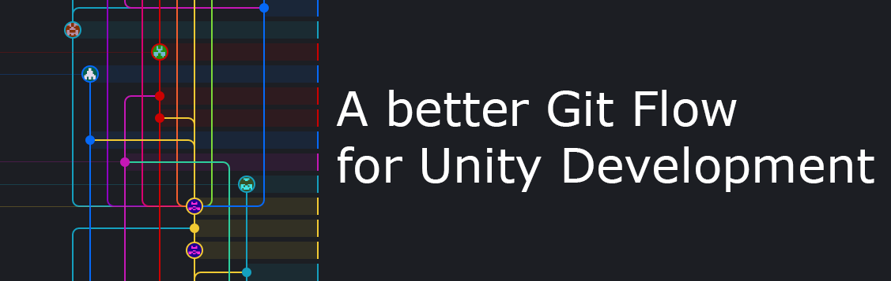

## A better Git Flow for Unity Development

Bibliography : 
- [A successful branching model](https://nvie.com/posts/a-successful-git-branching-model/)
- [Git branches strategies](https://www.gitkraken.com/learn/git/best-practices/git-branch-strategy)
- [Git Flow cheatsheet](https://danielkummer.github.io/git-flow-cheatsheet/)